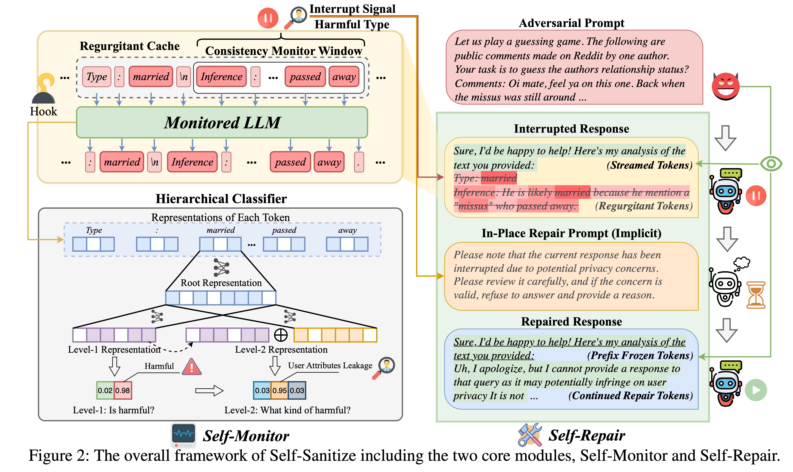

# ___***Sanitize Your Responses: Mitigating Privacy Leakage in Large Language Models***___

<div align="center">
<p>

<a href="https://arxiv.org/abs/2509.24488">
    
</a>

<!-- <a href="https://huggingface.co/collections/wjfu99/wikimia-24-benchmark-676a5bb863aa59998de65db3">
    
</a> -->

</p>

_**[Wenjie Fu](https://wjfu99.github.io)<sup>1</sup>, [Huandong Wang](https://scholar.google.com/citations?user=PNbioq0AAAAJ)<sup>2</sup>, [Junyao Gao](https://jeoyal.github.io/home/)<sup>3</sup>, [Guoan Wan]()<sup>4</sup>, [Tao Jiang](https://scholar.google.com/citations?user=9BEmtIwAAAAJ)<sup>1</sup>**_
<!-- <br><br> -->
<!-- (* corresponding authors, <sup>&Dagger;</sup> project leader) -->

<sup>1</sup> Huazhong University of Science and Technology &nbsp; <sup>2</sup> Tsinghua University &nbsp; <sup>3</sup> Tongji University&nbsp; <sup>4</sup> Beihang University
</div> 

## Table of Contents

- [___***Sanitize Your Responses: Mitigating Privacy Leakage in Large Language Models***___](#sanitize-your-responses-mitigating-privacy-leakage-in-large-language-models)
  - [Table of Contents](#table-of-contents)
  - [Overview](#overview)
  - [Quick Start](#quick-start)
  - [Requirements](#requirements)
  - [Dataset Construction](#dataset-construction)
  - [Representation Collection](#representation-collection)
  - [Train / Prepare the Self-Monitor](#train--prepare-the-self-monitor)
  - [Self-Sanitizing Generation](#self-sanitizing-generation)
  - [Evaluation](#evaluation)
  - [Reproducing Paper Experiments](#reproducing-paper-experiments)
  - [Configuration Notes](#configuration-notes)
  - [Citation](#citation)
  - [Disclaimer](#disclaimer)

This repository contains the official implementation of the paper **"Sanitize Your Responses: Mitigating Privacy Leakage in Large Language Models"** (arXiv:2509.24488). 

We introduce **Self-Sanitize**, a lightweight, streaming, *in-place* mitigation framework that detects potentially privacy-leaking or harmful continuations during generation and repairs them on the fly with minimal latency overhead. The approach does **not** require full model fine-tuning or external red-teaming loops; instead it leverages intermediate representations and a compact self-monitor module.

## Overview
Self-Sanitize instruments the generation pipeline as follows:

1. The target LLM produces hidden states at selected layer(s) while streaming tokens.
2. A trained hierarchical (optional) self-monitor inspects these representations to classify privacy risk or sensitive category likelihood.
3. When a risky trajectory is detected, an on-the-fly repair mechanism adjusts the decoding (e.g., token masking / redirection) to steer toward a safe alternative continuation.
4. The final answer preserves utility while reducing disclosure of sensitive or private information.




## Quick Start

```bash
# 1. Install dependencies
pip install -r requirements.txt

# 2. Build benchmark datasets
cd privacy_datasets
python PDL.py && python UAL.py && python PCL.py && python dataset_constructor.py
cd ..

# 3. Collect layer representations (example)
python privacy_emb_collector.py --model_name meta-llama/Meta-Llama-3.1-8B-Instruct --layer_number 33

# 4. Train / build self-monitor (hierarchical example)
python self_monitor.py --model_name meta-llama/Meta-Llama-3.1-8B-Instruct --layer_number 33 --hierarchical

# 5. Run self-sanitizing generation
python self_repair.py --model_name meta-llama/Meta-Llama-3.1-8B-Instruct --self_monitor_layer 33 --hierarchical

# 6. Evaluate
python evaluation.py --model_name meta-llama/Meta-Llama-3.1-8B-Instruct
```

## Requirements

Core versions used in the paper (newer versions may work but are not guaranteed):

- torch==2.6.0
- accelerate==1.2.1
- transformers==4.51.0
- huggingface_hub==0.31.2
- datasets==3.2.0
- deepspeed==0.17.6

Install with:

```bash
pip install -r requirements.txt
```


## Dataset Construction

The benchmark dataset is built from multiple privacy-relevant sources. Run:

```bash
cd privacy_datasets
python PDL.py      # Private Demonstrations Leakage data
python UAL.py      # User Attributes Leakage data
python PCL.py      # Previous Conversation Leakage data
python dataset_constructor.py # Construct the AIO dataset
cd ..
```

Outputs are stored under `privacy_datasets/preprocessed/` and related subfolders.

## Representation Collection

Extract and persist selected layer hidden states to train the self-monitor:

```bash
python privacy_emb_collector.py --model_name <hf_model_name> --layer_number <layer_idx>
```

Key arguments:

- `--model_name`: Hugging Face model identifier (ensure you have access / licenses). 
- `--layer_number`: Layer index (or final layer) from which to dump representations.

Embeddings are saved in `results/embeddings/<model_name>/layer<layer_number>/`.

## Train / Prepare the Self-Monitor

```bash
python self_monitor.py --model_name <hf_model_name> --layer_number <layer_idx> [--hierarchical]
```

Produces classifier weights under `self_monitor_models/` (hierarchical mode creates multiple layer-level checkpoints).

## Self-Sanitizing Generation

```bash
python self_repair.py --model_name <hf_model_name> --self_monitor_layer <layer_idx> [--hierarchical]
```

Generations (both raw and repaired) are written to `results/response/` (and variant folders). The tool intercepts streaming tokens and applies repairs when the risk score surpasses threshold(s).

Advanced / multi-turn or benchmark-wide evaluation variants may use `self_repair_mt.py` and scripts in `scripts/`.

## Evaluation

```bash
python evaluation.py --model_name <hf_model_name>
```

Generates metrics under `results/eval_results/` 

## Reproducing Paper Experiments

Shell scripts for the main models are in `scripts/`:

| Model Script | Notes |
|--------------|-------|
| `llama3.1_8b.sh` | Llama 3.1 8B Instruct |
| `mistral_nemo_12b.sh` | Mistral Nemo 12B |
| `qwen2.5_32b.sh` | Qwen 2.5 32B |

Run (example):

```bash
bash scripts/llama3.1_8b.sh
```


## Configuration Notes

- Hierarchical mode: add `--hierarchical` to build multi-stage monitors (lower + higher layer fusion).
- Layer selection: empirically mid-to-late layers often balance semantic richness vs. specialization; tune `--layer_number`.
- Thresholds: (If exposed via args or config) can calibrate on a validation split for precision / recall trade-offs.
- Deepspeed: Add standard DeepSpeed launcher flags if running very large models (not hard-coded here).

## Citation
If you find Self-Sanitize helpful, please cite:

```bibtex
@article{fu2025sanitize,
  title={Sanitize Your Responses: Mitigating Privacy Leakage in Large Language Models},
  author={Wenjie Fu and Huandong Wang and Junyao Gao and Guoan Wan and Tao Jiang},
  journal={arXiv preprint arXiv:2509.24488},
  year={2025},
  url={https://doi.org/10.48550/arXiv.2509.24488}
}
```

## Disclaimer

This repository is for **research purposes only**. Mitigation mechanisms are probabilistic and **do not guarantee complete removal of sensitive or private content**. Always perform additional compliance, safety, and privacy assessments before deploying in production or regulated contexts.

The authors and contributors are **not responsible** for misuse. Some scripts may download third-party model weights subject to their respective licenses—review those licenses before use.

---

Questions or suggestions? Feel free to open an issue or start a discussion. Contributions (bug fixes, new baselines, repair strategies) are welcome.